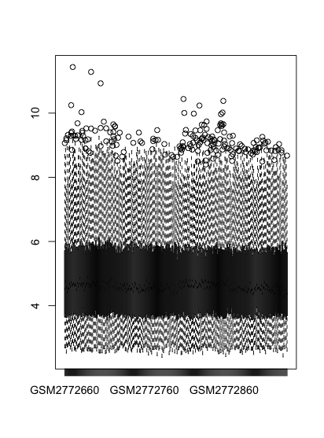
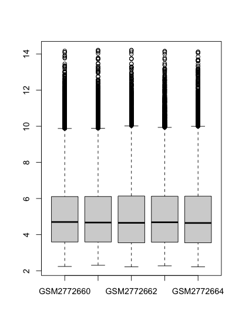
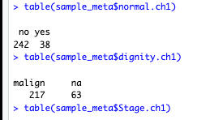
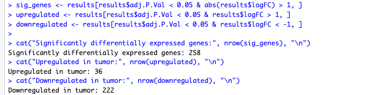
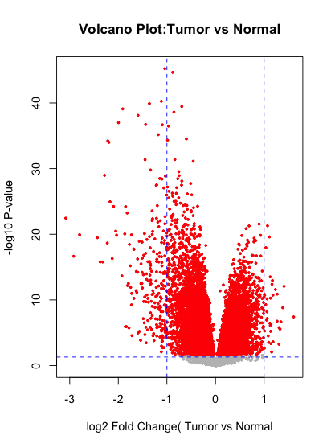
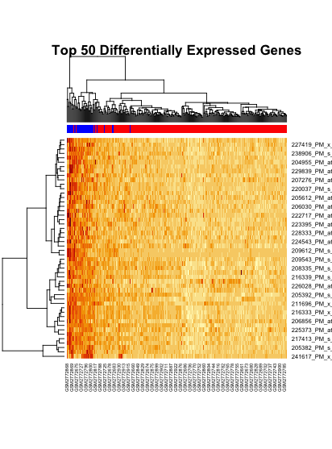
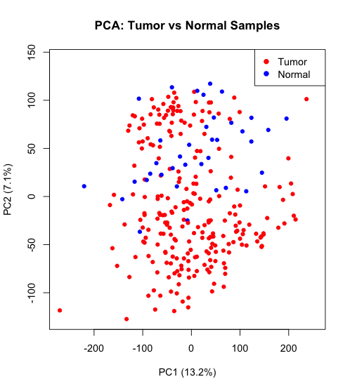

For this project my goal is to download data from Gene Expression Omnibus(GEO), using R and perform Differential analysis on it.

For that I first installed the package GEOquery using the command

```r
install.packages("GEOquery)
```
Then I got this warning that GEOquery is not available for my current version of R that is above 4.4

So I changed my Bioconductor version 

```angular2html
BiocManager::install(version ="3.19")
BiocManager::install("GEOquery")

```
Now it got installed properly and then I loaded it using.

```angular2html
> library(GEOquery)
```

Now I had to download my file from the GEO database using the following command

```angular2html
> gse<-getGEO("GSE103512", GSEMatrix = TRUE)
```
Till here we have downloaded a database GSE1035512, getGEO contacted GEO and got the data.

This is a compressed file with rows = probes/ genes. And some metadata at the bottom. 
GEO Query package automatically decompresses it..

Then we load SummarizedExperiment library, it has standard containers for genomic data, because we do not want to juggle with different spreadsheets.

```angular2html
library(SummarizedExperiment)
```

```angular2html
gsm_1<- as(gse$GSE103512_series_matrix.txt.gz, "SummarizedExperiment")
gsm_1
```

Output -

```
class: SummarizedExperiment 
dim: 54715 280 
metadata(3): experimentData annotation protocolData
assays(1): exprs
rownames(54715): 1007_PM_s_at 1053_PM_at ...
AFFX-TrpnX-5_at AFFX-TrpnX-M_at
rowData names(16): ID GB_ACC ...
Gene.Ontology.Cellular.Component
Gene.Ontology.Molecular.Function
colnames(280): GSM2772660 GSM2772661 ... GSM2772938
GSM2772939
colData names(72): title geo_accession ... tumorsize.ch1
weight.ch1
```
We can clearly see that it has 54715 features and 280 samples
- rownames is obviously the names of the rows in the assay, 54715 here, the number of genes.

- rowData is the metadata about the rows
- colnames is the number of samples, 280 here
- colData names is the metadata about columns

### We are now going to perform differential expression, clustering, PCA, visualisation on it.

I first tried plotting first 100 genes across all samples. Since there are more than 200 samples, I was not able to figure out anything.

```angular2html
> boxplot(assay(gsm_baby[1:100,]))
```


I then plotting the first 5 samples across all the genes, and bingo, that gave some clarity.

```
> boxplot(assay(gsm_baby[,1:5 ]))
```



The boxes which are 25th of the 75th percentile are all at the same height meaning the data is Normalized. Black horizontal line is the median.
It is similar beween 4.5-5 .There are dots above which are individual genes with unusually high expression.

------------------------------
Now exploring how to cluster by checking what there is in the sample meta data.

```angular2html
> colnames(sample_meta)
```
This will display all the column names in the sample metaData. Out of those I suspected that normal.ch1 could be having normal vs tumor values

I tried

```angular2html
> table(sample_meta$normal.ch1)
```

Output was



That means 38 are normal and 242 have tumor. AHA! 

Now we will do differential expression analysis on it using limma. Ofcourse, if it was RNA-seq data we would have used DESeq2.

```angular2html
library(limma)
```

First we will create the grouping factor, essential for labelling the samples

```angular2html
> tissue_type <- factor(sample_meta$normal.ch1, levels = c("yes","no"), labels = c("Normal","tumor"))
```
Creating design matrix, if a sample has 0 means it does not belong to that group, if it has 1 it means that it does belong to that group.

```angular2html
design <- model.matrix (~ 0 + tissue_type)
```
Lima uses Linear regression model here which is bsed on supervised machine learning. This fits linear regression model, 54715 genes to check which are up or downregulated in tumor vs normal

```angular2html
contrast.matrix <- makeContrasts(
  +     TumorVsNormal = tumor - Normal,
  +     levels = design
  + )
```
Here we are telling Limma to compare normal tumor vs normal

```angular2html
fit2 <- contrasts.fit(fit, contrast.matrix)
fit2 <- eBayes(fit2)
```
Then we perform statistical testing on both the groups, Bayes empirical is used to imporve the statistical power.

Our fit2 has the raw statistical data. We use the following code to change it to a table which is readable.
```angular2html
results <- topTable(fit2, coef = "TumorVsNormal", 
+                     number = Inf,
+                     adjust.method = "BH")
```

Checking to see the top of the table ...
```angular2html
head(results, 10)
```

Then comes the most crucial part, we are filtering the genes that are both statistically significant AND biologically meaningful.

Biological significance I am calculatuing by taking the logFC as 1... that means 2 fold change. 

P-value is that if tumor and normal actually had the same average expression, what is the probability that I would see a difference just by a random chance.

We are setting the P-value to be 0.05, that means that there is a 5% chance that I see the results because of random sampling.

```

sig_genes <- results[results$adj.P.Val < 0.05 & abs(results$logFC) > 1, ]
upregulated <- results[results$adj.P.Val < 0.05 & results$logFC > 1, ]
downregulated <- results[results$adj.P.Val < 0.05 & results$logFC < -1, ]

cat("Significantly differentially expressed genes:", nrow(sig_genes), "\n")
cat("Upregulated in tumor:", nrow(upregulated), "\n")
cat("Downregulated in tumor:", nrow(downregulated), "\n")
```
Results ...



Now we plot these results for Data Analysis

First the Volcano plot
```
# Volcano plot
plot(results$logFC, -log10(results$P.Value), xlab="log2 Fold Change( Tumor vs Normal", ylab = "-log10 P-value" , main ="Volcano Plot:Tumor vs Normal", pch = 20, cex =0.6,col = "grey")
points(results$logFC[results$adj.P.Val < 0.05], 
       -log10(results$P.Value[results$adj.P.Val < 0.05]),
       pch = 20, cex = 0.6, col = "red")
abline(h = -log10(0.05), col = "blue", lty = 2)  # p-value cutoff
abline(v = c(-1, 1), col = "blue", lty = 2)

```
Our volcano plot is confirming what we found before, much more genes are downregulated than upregulated. 




Then a Heatmap of top 50 genes
```
> top_genes <- rownames(results)[1:50]
> top_expr <- expr_matrix[top_genes, ]
#heatmap
heatmap(top_expr, 
        ColSideColors = ifelse(tissue_type == "tumor", "red", "blue"),
        main = "Top 50 Differentially Expressed Genes")

```
Our heatmap shows that the tumour samples have downregulated genes. 



Then we get a PCA 
```
pca <- prcomp(t(expr_matrix), scale = TRUE)

plot(pca$x[,1], pca$x[,2], 
     col = ifelse(tissue_type == "tumor", "red", "blue"),
     pch = 19, cex = 0.8,
     xlab = paste0("PC1 (", round(summary(pca)$importance[2,1]*100, 1), "%)"),
     ylab = paste0("PC2 (", round(summary(pca)$importance[2,2]*100, 1), "%)"),
     main = "PCA: Tumor vs Normal Samples")
legend("topright", c("Tumor", "Normal"), col = c("red", "blue"), pch = 19)
```


The 2 fold changes are higher in tumor than in normal cells, I interpret that they downregulated and were expressed half times as before.

In our PCA, PC1 is 13.2% that 13.% og genes are different from others in a certain way.
PC2 is 7.1%, that these many samples are different in another way. (Second highest).

Since there is clear differentiation between tumor dots and normal dots and are mostly not mixed, that means that our data has real significance. This separation shows that tumor samles have different gene expression profiles compared to normal.


